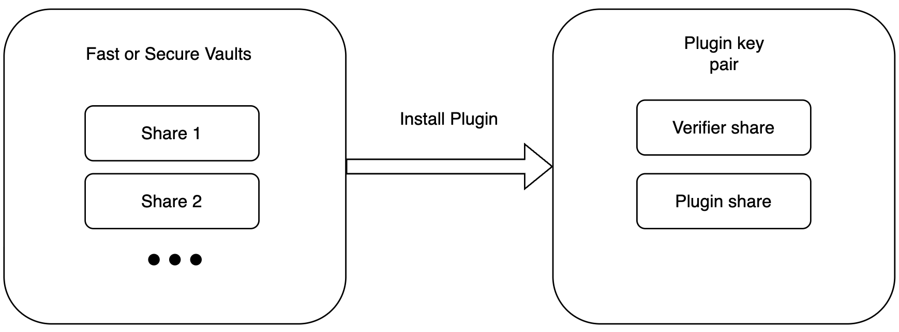

# PLUGINS

# Concept

Vultisig plugins are specialized services that allow transactions to be executed without direct user involvement. The transaction must strictly comply with the policy signed by the user.

This capability is made possible by the **keyshare** feature of the Vultisig wallet. The Vultisig Marketplace includes both in-house developed plugins and plugins created by other users.

## Key Terms

### **Policy**  
A structure defined by the plugin developer. It contains a set of parameters for executable transactions (transaction type, destination address whitelist, token quantity and type, networks, and execution frequency for recurring payments and subscriptions). [Link](#)

```go
type Policy struct {
   state protoimpl.MessageState `protogen:"open.v1"`
   // ID is a unique identifier for the policy
   Id string `protobuf:"bytes,1,opt,name=id,proto3" json:"id,omitempty"`
   // Name is a human-readable name for the policy
   Name string `protobuf:"bytes,2,opt,name=name,proto3" json:"name,omitempty"`
   // Description provides details about what the policy allows
   Description string `protobuf:"bytes,3,opt,name=description,proto3" json:"description,omitempty"`
   // Version is the policy version
   Version int32 `protobuf:"varint,4,opt,name=version,proto3" json:"version,omitempty"`
   // Author is the identifier of the plugin developer
   Author string `protobuf:"bytes,5,opt,name=author,proto3" json:"author,omitempty"`
   // Rules is an ordered list of permission rules
   Rules []*Rule `protobuf:"bytes,6,rep,name=rules,proto3" json:"rules,omitempty"`
   // CreatedAt is when the policy was created
   CreatedAt *timestamppb.Timestamp `protobuf:"bytes,7,opt,name=created_at,json=createdAt,proto3" json:"created_at,omitempty"`
   // UpdatedAt is when the policy was last updated
   UpdatedAt *timestamppb.Timestamp `protobuf:"bytes,8,opt,name=updated_at,json=updatedAt,proto3" json:"updated_at,omitempty"`
   // FeePolicies defines the billing configuration for this policy
   FeePolicies []*FeePolicy `protobuf:"bytes,11,rep,name=fee_policies,json=feePolicies,proto3" json:"fee_policies,omitempty"`
   // Plugin configuration
   Configuration *structpb.Struct `protobuf:"bytes,12,opt,name=configuration,proto3" json:"configuration,omitempty"`
   // MinExecWindow defines minimum allowed gap in seconds between policy txs batch executed
   RateLimitWindow *uint32 `protobuf:"varint,13,opt,name=rate_limit_window,json=rateLimitWindow,proto3,oneof" json:"rate_limit_window,omitempty"`
   // MaxTxsPerWindow defines maximum txs count in batch, actually rules count in policy, for example:
   // set 1 for erc20.transfer
   // set 2 for erc20.approve + erc20.transferFrom
   MaxTxsPerWindow *uint32 `protobuf:"varint,14,opt,name=max_txs_per_window,json=maxTxsPerWindow,proto3,oneof" json:"max_txs_per_window,omitempty"`
   unknownFields   protoimpl.UnknownFields
   sizeCache       protoimpl.SizeCache
}
```

### **Reshare**
An additional key pair generated when a plugin is "installed" and used to sign transactions. Transactions signed by this key pair are initiated by the plugin service and verified by the **verifier** service. To be approved by the verifier, transactions must exactly match the specified policy.

- Created shares can only be used in pairs and cannot be combined with any share from the main wallet to achieve a quorum of signatures.
- If a plugin is deleted, its share in the verifier is destroyed, rendering the plugin’s share unusable.

---

## Use Cases

Plugins enable automated transactions triggered by predefined conditions, eliminating the need for direct user involvement. Examples include:
- **Subscriptions**
- **Fees**
- **Recurring purchases and transfers**
- **Copy trading**
- **And more**

---

## Packages and Repositories

- **[Verifier](https://github.com/vultisig/verifier)**  
  The Verifier service registers plugins and stores one of the key shares and the user-validated policy upon plugin installation.

- **[Recipes](https://github.com/vultisig/recipes)**  
  A repository of tools for integrating blockchain networks with Vultisig, providing standardized handling of protocols and their requirements.

- **[Plugin](https://github.com/vultisig/plugin)**  
  Standard plugins library.

---

## Core Functions

To integrate with the Verifier, a plugin must:
1. Implement required API endpoints.
2. Maintain the `plugin_policies` table and other system tables.

### **API Endpoints**
```go
grp := e.Group("/vault")
grp.POST("/reshare", s.ReshareVault)
grp.GET("/get/:pluginId/:publicKeyECDSA", s.GetVault)     // Get Vault Data
grp.GET("/exist/:pluginId/:publicKeyECDSA", s.ExistVault) // Check if Vault exists
grp.POST("/sign", s.SignMessages)                         // Sign messages
grp.GET("/sign/response/:taskId", s.GetKeysignResult)     // Get keysign result
grp.DELETE("/:pluginId/:publicKeyECDSA", s.DeleteVault)   // Delete Vault

pluginGroup := e.Group("/plugin")
pluginGroup.POST("/policy", s.CreatePluginPolicy)
pluginGroup.PUT("/policy", s.UpdatePluginPolicyById)
pluginGroup.GET("/recipe-specification", s.GetRecipeSpecification)
pluginGroup.DELETE("/policy/:policyId", s.DeletePluginPolicyById)
```

### **Database Storage Interface**
```go
GetPluginPolicy(ctx context.Context, id uuid.UUID) (*vtypes.PluginPolicy, error)
GetAllPluginPolicies(ctx context.Context, publicKey string, pluginID vtypes.PluginID, onlyActive bool) ([]vtypes.PluginPolicy, error)
DeletePluginPolicyTx(ctx context.Context, dbTx pgx.Tx, id uuid.UUID) error
InsertPluginPolicyTx(ctx context.Context, dbTx pgx.Tx, policy vtypes.PluginPolicy) (*vtypes.PluginPolicy, error)
UpdatePluginPolicyTx(ctx context.Context, dbTx pgx.Tx, policy vtypes.PluginPolicy) (*vtypes.PluginPolicy, error)
```
The **SystemMigrationManager** in the Verifier package handles the creation of system tables.

---

## Triggers

Transactions are initiated by the plugin service using the SDK from the **Recipes** package.

---

## Fee Collection

Plugin developers define the fee structure, which users pay upon installation and continued usage of the plugin.

## Troubleshooting
When running locally for debugging, you may encounter this error:
```
dyld[44167]: Library not loaded: /Users/johnnyluo/project/wallet/dkls23-rs/target/aarch64-apple-darwin/release/deps/libgodkls.dylib
```
For solving this you need to specify `DYLD_LIBRARY_PATH` env with dkls lib path. Latest version of the libraries you can find [there](https://github.com/vultisig/go-wrappers)

```

